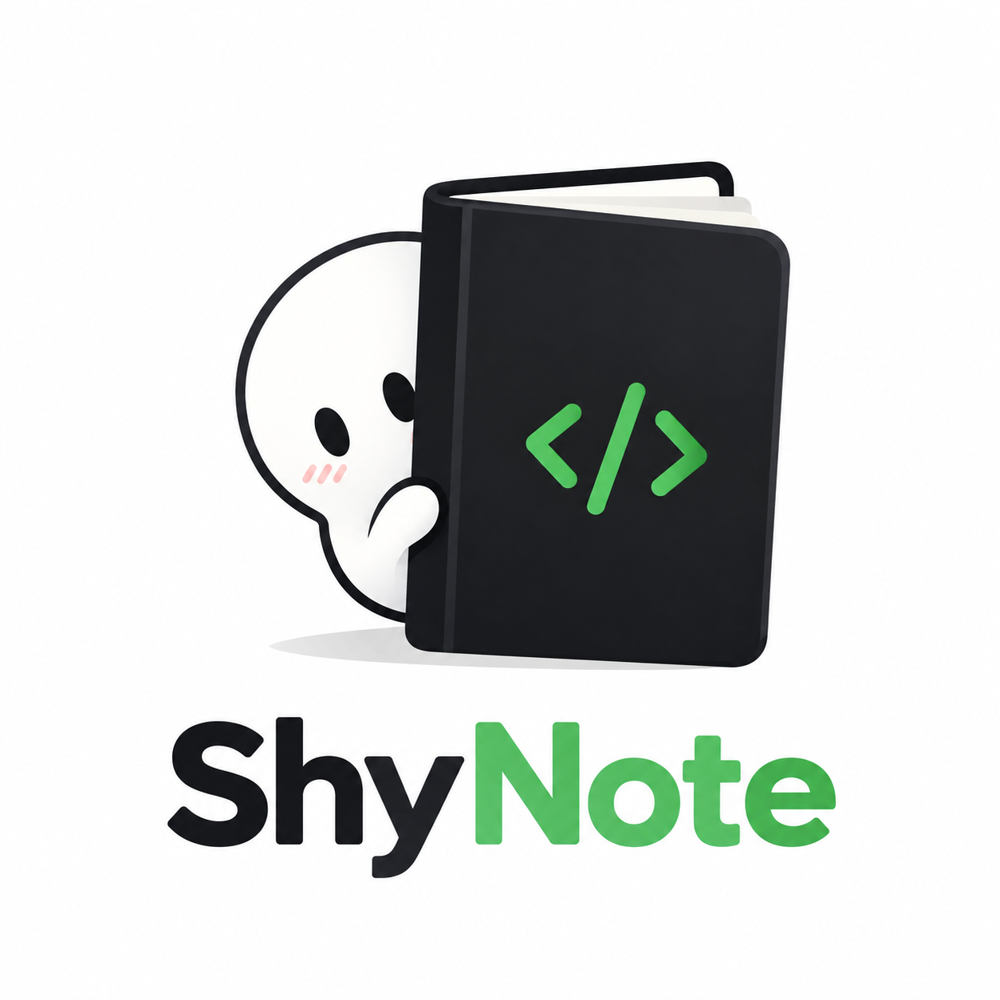

# ShyNote



---
This section is wrote by human and should be read by human (and agents?)

I cannot be the only person upset about the crazy number of notes the coding agents create while developing.
They can certainly be useful, but they also contain a lot of internal information, usually more than what I would comfortably share with the rest of the world.
Also, they're just not part of source code, nor are the documentations, so why are they version controlled and tracked by git?
Still, we should track them somehow. Agents might want to reference them from time to time.
Hence, I (vibe) coded this tool.
Thanks Codex.

---

A persistent notebook for coding agents, scoped to a repository. Write Markdown
notes locally, push findings worth keeping, and pull them into another checkout
when needed.

Each notebook uses one backend: **S3** or **Notion**. A `.shynote` file records the
storage location and local notes directory. Commit that configuration to share
the notebook; scratch notes and local tracking are ignored by default.

## Get started

Requires Python 3.11+. From this source checkout, install the backend you use:

```sh
pip install -e '.[s3]'
# For Notion: pip install -e '.[notion]'
```

Have an existing S3 bucket and AWS credentials, or a Notion parent page and token.
Then run this in the repository where you want notes:

```sh
shynote init
```

The wizard checks access and sets up `.agent/notes/` by default. Create a note
there and push it:

```sh
printf '# Finding\n\nA useful observation.\n' > .agent/notes/finding.md
shynote push finding.md
shynote list
```

Push and pull paths are relative to the configured notes directory. To preview
local edits, use `shynote push finding.md --dry-run`. Updating an existing Notion
note requires `--unconditional` because that backend cannot make atomic
conditional writes.

See [Getting started](docs/getting-started.md) for credentials and noninteractive
setup, or the [documentation index](docs/README.md) for the full reference.

## Current scope

The CLI supports push, pull, title search, and conflict detection. `push --all`
includes new Markdown files in the notes directory; `pull --all` refreshes locally
tracked files. Transfers stop at the first failure. S3 also supports
archiving. Content search, automatic merging, and an MCP interface are not
implemented.

## Agent skill

The [ShyNote skill](skills/shynote/SKILL.md) teaches coding agents how to find
relevant notes, publish findings, and handle transfer results. Copy the complete
`skills/shynote/` folder into your agent's skills directory. It includes a setup
reference and optional Codex discovery metadata; the CLI must be installed
separately.

## Development

```sh
uv sync --all-extras
uv run --all-extras python -m unittest discover -v
```

See [Development](docs/development.md) for test scope and optional live checks.
